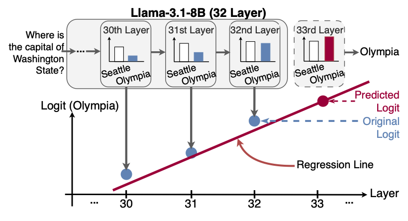

DeLTa: A Decoding Strategy based on Logit Trajectory Prediction Improves Factuality and Reasoning Ability
===
Code for paper "DeLTa: A Decoding Strategy based on Logit Trajectory Prediction Improves Factuality and Reasoning Ability"
Paper: [https://arxiv.org/abs/2309.03883  ](https://arxiv.org/abs/2503.02343/)
Authors: Yunzhen He $^1$, Yusuke Takase $^1$, Yoichi Ishibashi $^{2*}$, Hidetoshi Shimodaira $^{1,3}$  
$^1$ Kyoto University, $^2$ NEC, $^3$ RIKEN AIP, $^*$ Work done while at Kyoto University.

## Overview

*Overview of DeLTa. When input tokens are fed into the LLM, the logits from each layer (e.g., layers 30, 31, and 32) are computed and shown as bar graphs to illustrate changes between tokens (e.g., “Seattle” vs. “Olympia”). A linear regression (red line) approximates the logit trajectory (blue dots). Using this regression, we extrapolate the logits for a virtual 33rd layer (red dot) and improve prediction beyond the original outputs.*